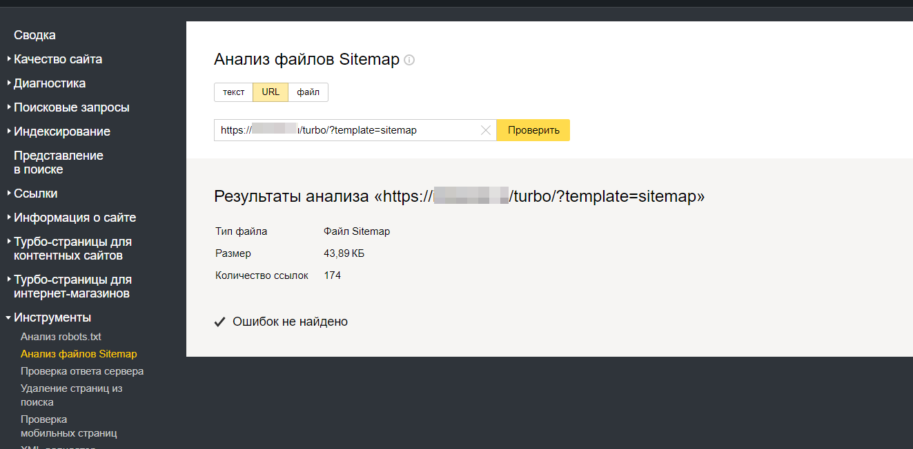

# Sitemap для Mediawiki

<SiteInfo name="Sitemap и YandexTurbo для Mediawiki" url="https://ichiblog.ru/my-projects/yandex_turbo_for_mediawiki/" desc="Скрипт для формирования страниц, работает через api" preview="/preview_site/github.com_ichinya_yandex_turbo_for_mediawiki.png" repo="https://github.com/Ichinya/yandex_turbo_for_mediawiki" />

Небольшое дополнение к движку MediaWiki, которая создает rss ленты. В основном, это нужно для добавления в [ЯндексТурбо](/mediawiki/turbo). Скачать можно с [GitHub](https://github.com/Ichinya/yandex_turbo_for_mediawiki)

Начиная с версии 1.2 появилась возможность построения sitemap

Шаблон сделан для webmaster Яндекса. Доступ к карте сайте получается по ссылке:

    https://site.ru/turbo/?template=sitemap

## На счет оптимизации

Я проверяю на своем небольшом сайте на движке mediawiki, на котором примерно 100 статей. Скорость вывода страницы sitemap — примерно 600мс.

