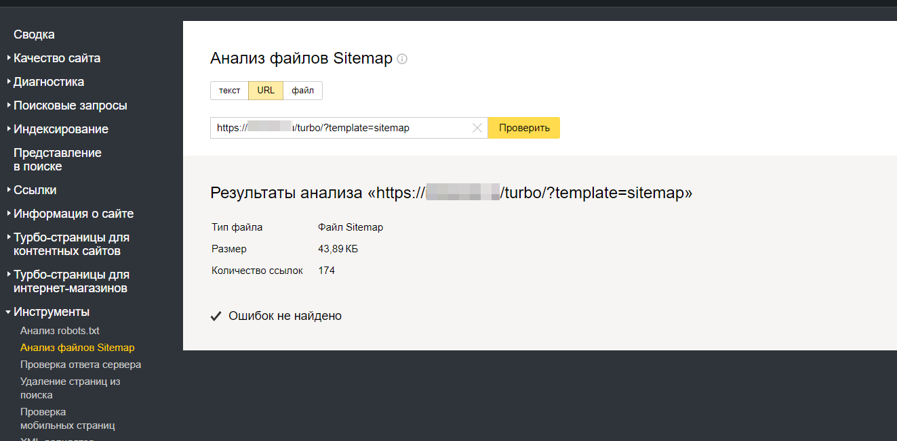

# Яндекс.Турбо в Mediawiki

Небольшое дополнение к движку MediaWiki, которая создает rss ленты. В основном, это нужно для добавления в ЯндексТурбо.

Скачать можно с [GitHub](https://github.com/Ichinya/yandex_turbo_for_mediawiki)

## Установка

Скопировать папку в корень сайта mediawiki. После чего лучше посмотреть настройки в файлах конфигурации скрипта `config.inc.php` и ленты rss `rss_templates\turbo.params.php` (стандартные настройки подойдут для многих)

Файлы с настройками создадутся автоматически при первом обращении. После чего их можно отредактировать и установить нужные параметры RSS ленты

## Вызов ленты RSS

* `сайт/turbo` выведется список адресов лент rss (для Яндекс Турбо)
* `сайт/turbo?page=0` лента RSS с шаблоном по умолчанию (задается в конфиге)
* `сайт/turbo?template=new` выводится список лент RSS с шаблоном new (название шаблона указано для примера)
* `сайт/turbo?template=new&page=0` лента с шаблоном new (название шаблона указано для примера)

## Возможности

* Не требуется авторизация к сайту. По идее может работать даже из другого места. Работает полностью через api mediawiki
* Есть кэширование страниц, при первом запуске создается файл `cache.db`, в котором будут храниться страницы для rss лент
* Можно изменить почти что угодно. Код довольно простой, параметры апи храняться в файлах `params_*.json`
* Можно добавить шаблоны, просто нужно создать три файла: `шаблон.item.php` (один элемент ленты), `шаблон.rss.php` (лента), `шаблон.default_params.php` (параметры ленты по умолчанию) и `шаблон.params.php` (параметры ленты, создается при первом обращении к ленте)
* Вызов шаблона (при использовании не по-умолчанию) происходит с параметром GET `template=шаблон`
* При обновлении скрипта на Git придет уведомление на e-mail, который указан в конфиге
* При обновлении скрипта, обновляет кэш (можно удалить, но тут будет больше нагрузка на сервер)

## Ограничения

Ограничения самим api у mediawiki, возможно потребуется настраивать авторизацию или доступ к api
На сайтах с большим количеством статей могут быть сильные нагрузки. При использовании кэша нагрузка меньше

