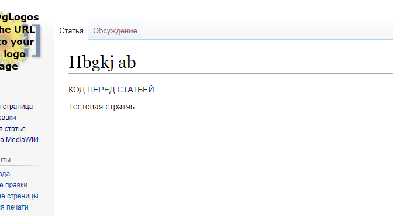

# РСЯ в Mediawiki

Шаблон Vector у MediaWiki довольно сложный для понимания, особенно тем, кто в программировании не особо силён. Так что тут описывается как это можно сделать

Для изменения файлов, Вы должны хотя бы немного понимать код, так как можно банально испортить работоспособность сайта. Поэтому все изменения делаются на свой страх и риск.

Мы будем работать с двумя файлами: *VectorTemplate.php* и *SkinVector.php*. Оба файла находятся в папке `сайт.рф/skins/Vector/includes`

Для начала работаем с файлом *VectorTemplate.php*. Находим в нем функцию `private function getSkinData()`. В самом начале функции присеваются переменные. Нас тут интересует переменная $out, после её инициализации нужно добавить код:

```php
private function getSkinData() : array {
    $contentNavigation = $this->getSkin()->getMenuProps();
    $skin = $this->getSkin();
    $out = $skin->getOutput();
    $title = $out->getTitle();

    $mainPageHref = Skin::makeMainPageUrl();
    $newTalksHtml = $skin->getNewtalks() ?: null;

    // -- ТУТ ВСТАВЛЯЕМ НАШ КОД
    $out->addHeadItem('ya_rtb', '<!-- Yandex.RTB -->
    <script>window.yaContextCb=window.yaContextCb||[]</script>
    <script src="https://yandex.ru/ads/system/context.js" async></script>
    ');
    // -- КОНЕЦ ВСТАВКИ

    $commonSkinData = $skin->getTemplateData() + [
...
```

Что мы сделали? Мы добавили новую строчку в раздел head сайта. В принципе, тут так и пишем *addHeadItem* - добавить новый элемент head. Первый аргумент, у меня это ya_rtb - это просто идентификатор элемента, это нужно, чтобы при определенных условиях данный item заменить или удалить. Но нас это не интересует, потому что код будет вызываться на всех страницах сайта. Так что придумываем стопроцентно уникальную строчку, например, абракадабру.

Вторым аргументом вписываем саму строчку. Тут просто - код берем из РСЯ. Сейчас он у всех общих, так что можно просто скопировать. С первым файлом закончили.

Приступаем ко второму файлу *SkinVector.php*. Тут немного сложнее. В файле нужно найти функцию @public function getTemplateData()@, работать будем в данном методе.

Сразу в самом начале создаем переменную c кодом вызова, например, @yandeRTBHTML = 'КОД ВЫЗОВА РЕКЛАМЫ'; @. А теперь немного модифицируем то, что выдает функция: ``` 'html-body-content' => $yandeRTBHTML . $this->wrapHTML( $title, $out->mBodytext ); ```. В итоге получается:

```php
public function getTemplateData() {
$out = $this->getOutput();
$title = $out->getTitle();

    $indicators = [];
    foreach ( $out->getIndicators() as $id => $content ) {
        $indicators[] = [
            'id' => Sanitizer::escapeIdForAttribute( "mw-indicator-$id" ),
            'class' => 'mw-indicator',
            'html' => $content,
        ];
    }

    $printFooter = Html::rawElement(
        'div',
        [ 'class' => 'printfooter' ],
        $this->printSource()
    );

    $yandeRTBHTML = 'КОД ВЫЗОВА РЕКЛАМЫ ЯНДЕКСА';

    return [
        'array-indicators' => $indicators,
        'html-printtail' => WrappedString::join( "\n", [
            MWDebug::getHTMLDebugLog(),
            MWDebug::getDebugHTML( $this->getContext() ),
            $this->bottomScripts(),
            wfReportTime( $out->getCSP()->getNonce() )
        ] ) . </body></html>',
        'html-site-notice' => $this->getSiteNotice(),
        'html-userlangattributes' => $this->prepareUserLanguageAttributes(),
        'html-subtitle' => $this->prepareSubtitle(),
        'html-undelete-link' => $this->prepareUndeleteLink() ?: null,

// НИЖЕ ДОБАВЛЯЕМ ЭТУ ПЕРЕМЕННУЮ, НЕ ЗАБЫВАЕМ ТОЧКУ
'html-body-content' => $yandeRTBHTML . $this->wrapHTML( $title, $out->mBodytext ) . $printFooter,
'html-after-content' => $this->afterContentHook(),
];
}
```

В принципе и всё. Реклама будет показываться под заголовком статьи.


