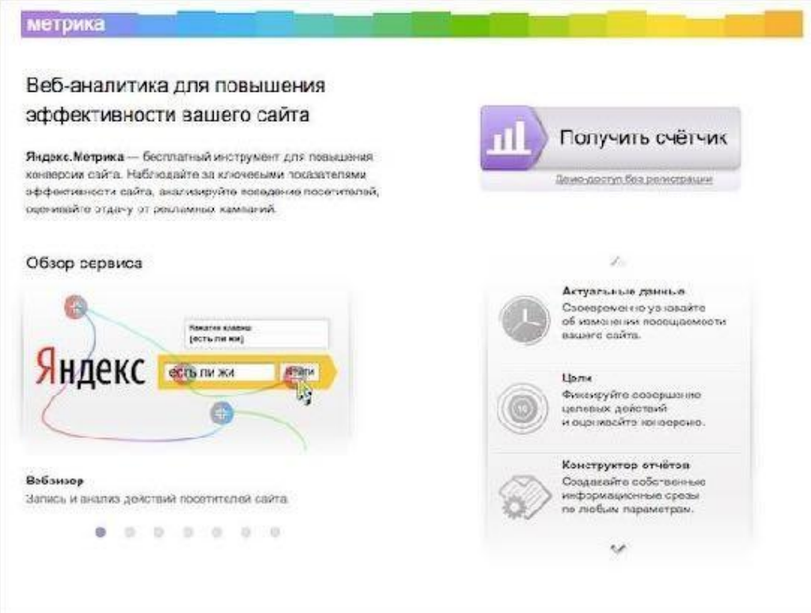

# Аналитика

Наиболее популярные системы аналитика:

* Яндекс.Метрика
* Google Analytics
* Mail.Ru

## Зачем использовать аналитику

* Подготовка к рекламным кампаниям – анализ целевой аудитории
* Анализ результатов рекламных кампаний: тестирование и контроль

## Что можно получить

* Пол
* Возраст
* Геоположение
* Интересы
* Доход
* Сколько смотрят телевизор
* Какие соцсети интересны
* Какие соцсети продают
* Устройства
