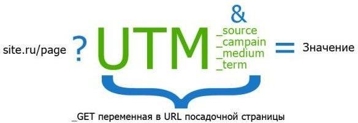
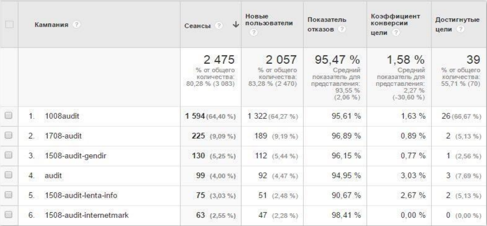
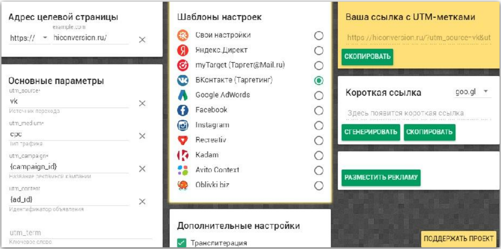

# UTM-метки

Это метки, которые вы можете добавить в ссылки любых объявлений, чтобы получать более подробную информацию о каждомклике по каждому вашему объявлению.

| Utm-метка | Значение| Описание|
| :--: | :--: | :--:|
| ***Обязательные*** |
| **utm_source** | _Рекламная система_:   Яндекс Директ   Google Adwords |  utm_source=Yandex_Direct   utm_source=Google_Adword |
| **utm_medium** | _Тип трафика_:   cpc (оплата за клик)   cpm (оплата за показы)  email рассылка |  utm_medium=cpc  utm_medium=cpm  utm_medium=email |
| **utm_campaign** | _Рекламная кампания_: Детские игрушки Детские коляски |  utm_campaign=kids_toys  utm_campaign=kids_strollers |
| ***Опциональные*** |
| **utm_term** | _Ключевое слово_, которое инициировало показ объявления | utm_term=klychevoe_slovo |
| **utm_content** | _Содержание объявления_ | utm_content=text   utm_content=text_2   utm_content=banner |

## Для чего нужны utm-метки

Такие метки в рекламе нужны для анализа данных. Потом в отчете можно увидеть, откуда и в рамках какой рекламы пришел клиент.

## Генераторы UTM-меток

Есть сайты для генерации меток. Пример такого сайта можно увидеть на скриншоте ниже.

