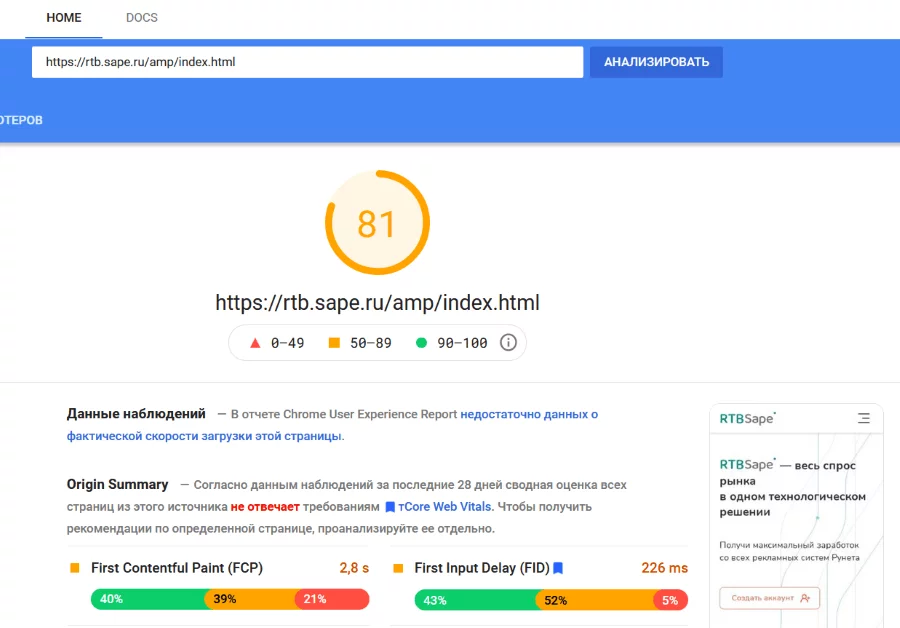

# PageSpeed Insights

Инструмент, который анализирует такой важный показатель, как скорость загрузки страниц. PageSpeed Insights имитирует загрузку с разных устройств и дает рекомендации, как ее ускорить.

## Зачем вебмастеру нужен PageSpeed Insights?

* *Время загрузки страниц напрямую влияет на доходы вебмастера.* Во-первых, пользователь может не дождаться и уйти. Во-вторых, он может остаться, но начать скроллить. Тогда рекламное объявление в верхней части экрана загрузится после того, как человек пролистает ленту вниз. А если пользователь не увидит рекламу, вебмастер не получит за нее деньги.

* *Сайты с низким значением PageSpeed Insights понижаются в выдаче Google.* Вебмастер лишается важного органического трафика с этого поисковика. При этом именно такой трафик наиболее ценен.

## Зачем вебмастеру использовать PageSpeed Insights?

Ценность сервиса в том, что он не просто показывает текущую ситуацию со скоростью загрузки, но и дает конкретные рекомендации, как ее увеличить. Например, сжать все фото на сайте до 300 Кб, подключить отложенную загрузку изображений (lazyload), убрать лишние веб-шрифты, избыточных css и jss, отключить ненужные плагины и т.д.

Это не просто общие советы. Google использует данные, полученные при глубоком анализе страниц, поэтому соблюдение рекомендаций PageSpeed Insights действительно помогает повысить скорость.
