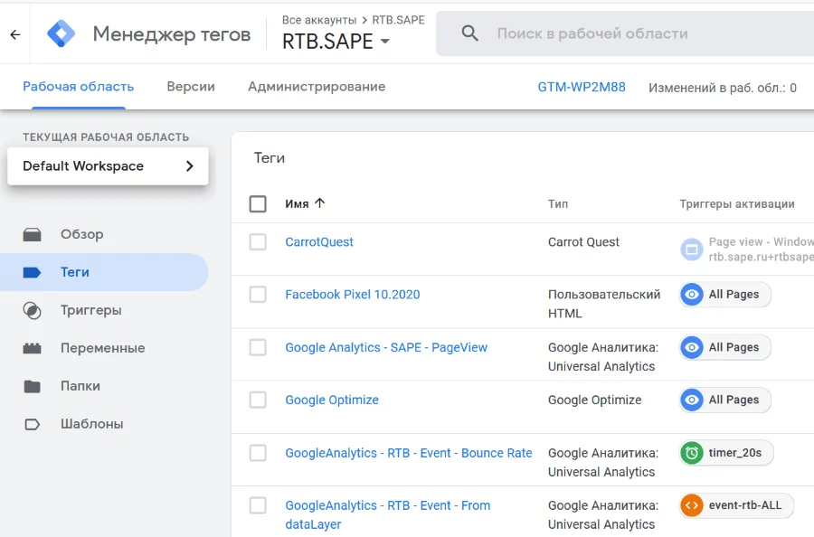

# Google Tag Manager

Диспетчер тегов с простым и удобным интерфейсом. Помогает создавать теги (фрагменты кода на странице), тестировать их и управлять ими.

## Зачем вебмастеру Google Tag Manager?

Бесплатный сервис позволяет:

* интегрировать на сайт Google Analytics и другие метрики;
* создавать пользовательские теги;
* заниматься отладкой тегов;
* откатываться к более ранним версиям;
* настраивать текстовую подмену на сайте.

## Как вебмастеру использовать Google Tag Manager в работе?

*Настраивать работу с тегами.* Современный вебмастер использует много кодов, которые нужно разместить на разных страницах сайта. При этом некоторые теги должны вызываться только при соблюдении определенных условий. Чтобы упростить задачу, можно установить на все страницы UTM-код, добавить все необходимые пиксели и выбрать настройки с помощью Google Tag Manager.

*Упростить работу с рекламными сетями.* Сервис позволяет быстро разместить разные коды рекламных сетей на разных страницах сайта. Вебмастер может добавить в настройках возможность использовать разные рекламные сети для разных типов аудиторий. Например, тизерные сети для аудитории 18+ или Push-сети для пользователей мобильных приложений.
