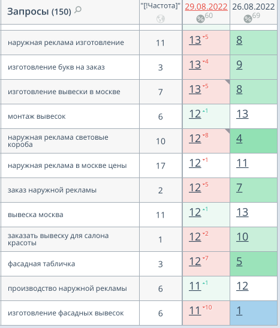
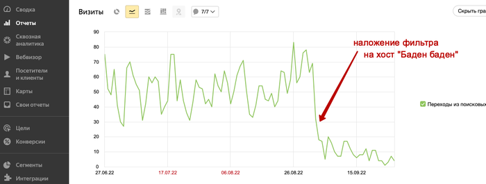
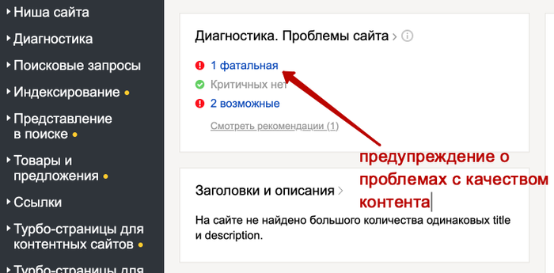
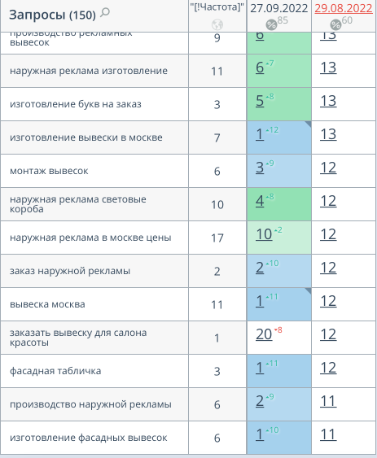
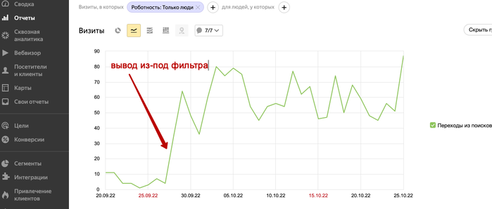

# Как вывести сайт из-под фильтра Баден-Баден

## Почему накладывается Баден-Баден

Основным образом жертвами Баден-Бадена становятся переспамные SEO-тексты.

Сюда относятся тексты:

* с ключами в стиле «авто Москва приобрести»,
* сделанные для черной оптимизации текста в невидимых слоях.

Речь идет о высочайшей «водности», спаме в заголовках и раздельно взятых сегментах текста.

Но на самом деле для индексации в поисковиках такие неадекватные словоформы уже не необходимы — ключ засчитывается, даже если отдельные слова разбросаны по различным частям предложения или даже текста.

Желаете запускать продукты с МТС? Присылайте информацию о стартапе по ссылке

Еще несколько обстоятельств наложения Бадена:

* напичканные главными словами заголовки,
* переспамленные H1,
* автогенерация слов в категориях интернет-магазинов.

## Принципиальный нюанс

Фильтр применяется только к текстовому наполнению страниц — перекрестные либо внешние ссылки, а также внутренняя оптимизация не оказывают воздействия на риск, только текстовая информация! При этом индексация не прекращается стопроцентно — трафик частично идет.

Если не решать делему с фильтром, то из постраничного часто переходит и хостовый фильтр, который накладывается на весь веб-сайт. И вместо просадки позиций по нескольким десяткам страничек позиции потеряют практически все страницы веб-сайта.

## Баден-Баден на примере

Фильтр состоит из 2-ух групп:

* **Постраничного** — применяется только к отдельным страничкам, а не сайту в целом. В итоге наблюдается проседание трафика с этих страничек, не связанное с общей посещаемостью.
* **Хостового** — применяется ко всему веб-сайту и задействуется, только когда ресурс содержит очень большое количество переспамленных страниц. Такое случается, когда копирайтерам предоставлялось однотипное ТЗ, не учитывающее современные требования по SEO-оптимизации.

Хостовый фильтр просто обнаружить через вебмастер «Яндекса» — в дилеммах сайта будет указана фатальная ошибка.

Это сопровождается резким падением практически всей выдачи примерно на 20 единиц:

## Как выйти из-под фильтра

Выйти можно только одним путем — устранить заспамленные тексты. При этом для этого применяются разные методики:

* Noindex — запрет индексации (работает не всегда).
* Переписывание текстов.
* Физическое удаление контента.

У каждого подхода есть свои аспекты и риски.

Главное беспокойство для обладателя — страх, что при удалении или переписывании СЕО-текстов, которые держали веб-сайт в топ-10 выдачи, ресурс не сумеет восстановить свои позиции, несмотря на выход из-под фильтра.

Но это, быстрее, заблуждение: SEO-статьи, написанные для коммерческих ресурсов год обратно или больше, имеют куда меньшее значение, так как алгоритмы поисковых систем постоянно меняются.

Потому если на сайте находятся устаревшие тексты, вы фактически ничего не потеряется от их удаления — может быть, сайт даже полностью восстановит позиции в выдаче.

С постраничной фильтрацией метод предельно понятен.

**1-ый шаг в «лечении» сайта** — найти страницы, которые подверглись санкциям. Последующие действия зависят от их заполнения.

* Для информационного ресурса пригодится заново собрать семантическое ядро, подготовить ТЗ и написать текст.
* Для коммерческого веб-сайта предпринимаются аналогичные шаги.

* Если вы попали под хостовую фильтрацию, а веб-сайт информационный — все печально, работы предстоит много. Необходимо обработать абсолютно все опубликованные статьи, а на информационном веб-сайте их могут быть тысячи и 10-ки тысяч.

С интернет-магазином незначительно проще. Оптимальное решение — работать с шаблонами.

* Из шаблона страничек нужно вырезать тексты, размещенные под товарными листингами на страничках товарных категорий и фильтров,
* на поддомене выстроить копию сайта, запретив его индексацию.

На самом деле Баден-Баден не относится к сложным и проблемным санкциям. **Снять его полностью возможно в течение месяца, максимум — 2-ух**.

**Для сопоставления**: санкции за накрутку внешних ссылок действуют не меньше полугода, а фильтр аффилиат совершенно печален для владельцев сайта.

## Выход из-под Бадена: практический пример

В один прекрасный момент на сайте по изготовлению и размещению внешней рекламы с встроенным в него интернет-магазиномкоторый продавал пленки, зеркальные пластики, оргстекло, дюралевые композитные панели внезапно была обнаружена мощная просадка входящего трафика из «Яндекса»:

В это же время в «Веб-мастере» появилось уведомление:

Спасибо за подсказку, неувязка определена!

Вывести ресурс оказалось не так уж трудно:

* Просмотрели шаблоны категорий и удалили из их тексты. После этого сайт был скопирован и перенесен на поддомен, спрятанный от поисковиков через meta-robots. Это необходимо, чтобы без труда получить доступ к текстам, если будет нужно их рерайтить.
* Уведомили «Веб-мастер» об устранении нарушений через соответствующую кнопку.
* Связались с техподдержкой поисковика.
* Переиндексировали категорийные странички.
* Две недели спустя опять связались с поддержкой «Яндекса», там ответили, что необходимо подождать.
* Через месяц кнопка сообщения об устранении препядствия снова стала активной, но фильтр убран не был. Опять написали письмо о проблеме и о том, что она была решена, свои слова подкрепили снимками экрана.
* Баден снят! При этом даже не пришлось дожидаться обновления «Yandex’а» — весь процесс восстановления занял немногим больше 40 дней.

Вот что вышло в итоге:

### Результат

В итоге нам получилось добиться таких показателей:

На самом деле выйти из-под фильтра нетрудно. Для этого нужно всего лишь знать порядок действий и не страшиться общения с техподдержкой «Яндекса», чтобы процесс ускорился.

Графические материалы взяты с сайта [Источника](https://one-life-story.ru/kak-vyvesti-sait-iz-pod-filtra-baden-baden-instrykciia/)
