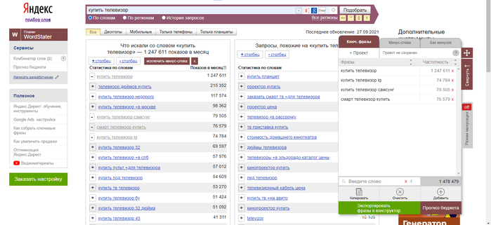
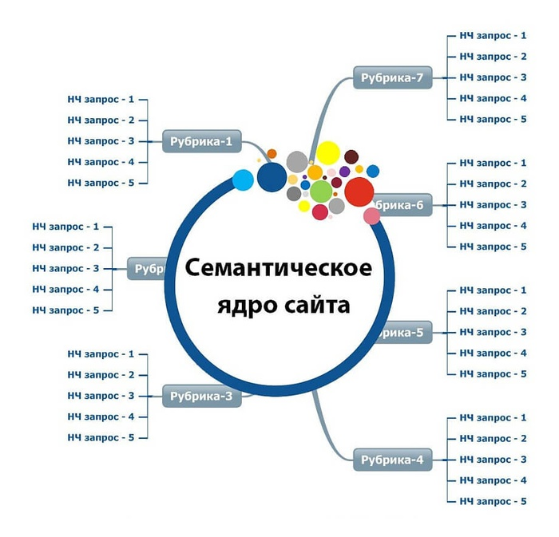

# Семантическое ядро

**Семантическое ядро сайта** - это упорядоченный набор слов, их морфологических форм и словосочетаний, которые наиболее точно характеризуют вид деятельности, товары или услуги, предлагаемые сайтом.

Обычно состоит из одного-двух высоко частотных слов и других ключевых слов, которые ранжируются по мере убывания частоты совместного использования с центральным запросом в общий коллекции.

Семантическое ядро, которая обнаружила поисковая система может очень сильно отличаться от "эталонного".

Семантическое ядро необходимо для того, чтоб:

* знать, на какие наши продукты и услуги есть поисковый спрос и осознавать какие запросы чаще ищут пользователи поисковых систем;
* выслеживать позиции своего сайта по запросам в выдаче;
* мониторить изменение позиций соперников;
* улучшить текст на странице, заполнить теги Title, Description, H1;
* сделать новые посадочные страницы, под которые есть поисковый спрос и релевантные продукты/услуги.

Если веб-сайт небольшой (до 100 страниц), то проработать семантику можно и без особых инструментов, используя только сервис Wordstat. Для удобства установите плагин WordStater либо его аналоги, которые помогут удобно работать с фразами.

Если веб-сайт довольно объемный или в тематике существует достаточно большое количество разнообразных поисковых запросов, то вам потребуются особые программы и сервисы, которые содержат готовые базы ключей либо имеют больше возможностей для автоматического сбора запросов.

Перечень подходящих сервисов:

* Букварикс;
* keys.so;
* megaindex;
* keycollector.

Они в основном платные, но отлично подходят для подбора ядра.

В первых 2-ух есть уже готовые базы. В «Мегаиндексе» можно поглядеть, по каким запросам ранжируются конкуренты и есть бесплатный набор нужных инструментов. Минус этих 3-х сервисов — они могут быть неполными и неточными, имеют возможность содержать большое количество «мусора» — нерелевантных запросов, по которым веб-сайт показывается случайно. Но такие сервисы очень экономят время при оценке семантики, по которой ранжируются соперники.

KeyCollector парсит статистику из «Yandex.Wordstat» по ключевым словам, поданным на вход. Можно собирать данные как из левой колонки (в какие еще поисковые фразы заходит введенное ключевое слово), так и из правой (какие еще похожие запросы вводили в поиск люди). Чем больше семантическое ядро, тем больше будет нужно времени на его чистку от нерелевантных запросов и кластеризацию.

Примерный процесс сбора семантического ядра:

* Собираете маркерные ключи по которым желаете продвигать сайт (основные запросы, которые вас заинтересовывают — названия услуг, категорий, товаров).
* Прорабатываете все варианты написания, синонимы, жаргонизмы, сокращения и т.п.
* Исследуете, как называют свои товары и услуги ваши соперники — они могут уже давно заниматься SEO и осознавать, какие запросы являются более конверсионными.
* По собранным запросам собираем поисковые подсказки (есть особые сервисы).
* Проверяем получившуюся подборку и удаляем нерелевантные запросы (под которые у нас нет продуктов и услуг).
* Парсим в KeyCollector по собранным запросам левую колонку «Yandex.Wordstat».
* Собираем разные варианты частотности запросов, чтобы сравнить их относительно друг друга.
* Удаляем запросы, которые нам не подходят.
* Делим ключи на группы — лучше всего использовать кластеризатор (советую keyassort, megaindex, rush-analytics).
* Разделяем информационные запросы и коммерческие.

Эту аннотацию лучше применять для отдельных разделов веб-сайта и повторять для каждой следующей. Для начала можно ограничиться и пт 1, 7, 10.

Есть и более резвый способ, если проект не новый. Из «Yandex.Метрики» можно выгрузить все запросы, по которым на веб-сайт были переходы из «Яндекс». По этим запросам мы уже ранжируемся, но быстрее всего, не по всем находимся в топе.

Это описание процесса в общих чертах. Очевидно, в каждой тематике и для каждого веб-сайта есть свои нюансы, которые нужно разбирать на определенных примерах. Тем не менее, собранные таким образом запросы посодействуют нам во внутренней оптимизации.
