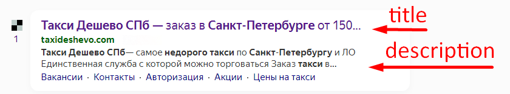

# Так ли важен Keywords сейчас?

С момента появления мета-тега прошло уже 25 лет, и почти все поисковые системы от него отказались по понятным причинам. В таких поисковиках, как Яндекс, Rambler, Mail.ru, Yahoo, Bing, отношение к Кейвордс довольно посредственное. Если они и используют его, то в крайне редких случаях.

## title — это заголовок HTML-элемента, который кратко описывает содержимое веб-страницы.

Тег находиться в html документе, внутри тега <head> … (синтаксис написания, ниже)

## Что такое description

**Description** — это заголовок HTML-элемента, который содержит расширенное содержание web-страницы, как правило из 2-3 предложений с важными ключевыми словами.

Тег находиться в html документе, внутри тега <head> … (синтаксис написания, ниже)

## Что такое h1 заголовок

**h1** – это HTML-тег первого уровня, который задает заголовок страницы/блока сайта.

Чтобы контент страницы для посетителя воспринимался быстрее и проще, в тексте используют второстепенные заголовки h2-h6 (вложенные подзаголовки), которые помогают правильно структурировать материалы, как для поисковиков, так и для пользователей.

Теги H находиться в html документе, внутри тега <body> … (синтаксис написания, ниже)

Синтаксис мета тегов title, description, h1

```html
<!doctype html>
<html lang="ru">

<head>
…
<title>Содержимое мета-тега Title</title>
    <meta name="description" content="Содержимое мета-тега Description" />
    <meta name="keywords" content="ключевые фразы или слова через запятую" />
…
<head>
<body>
…
<h1>Содержимое мета-тега h1 </h1>
…
<h2>Содержимое мета-тега h2 </h2>
…
<h3>Содержимое мета-тега h3 </h3>
…
<h4>Содержимое мета-тега h4 </h4>
…
</body>
</html>
```



## Использование в Google

В 2009 году Google [опубликовал статью](https://developers.google.com/search/blog/2009/09/google-does-not-use-keywords-meta-tag?hl=ru) о теге Keywords. В ответ на вопрос «Используется ли в поисковике мета-тег Keywords?» было официально заявлено, что нет. Это связано с тем, что в мета-теге вебмастера использовали много нерелевантных ключевых фраз.

Узнать подробнее о значении других мета-тегов можно на официальной странице разработчика.

## Использование в Яндекс

В официальной [документации](https://yandex.ru/support/webmaster/controlling-robot/html.html#meta) сообщается, что мета-тег с ключами может быть использован при определении соответствия страницы поисковым запросам. При использовании такого тега стоит учитывать содержимое страницы: все ключевые фразы должны точно описывать контент. Это могут быть как отдельные слова, так и словосочетания. Главное, чтобы они опирались на содержимое веб-страницы, а не на поисковую систему.

## Ограничения по длине при формировании SEO мета тегов
* **h1** - длина не более 70 символов
* **title** - длина не более 110 символов
* **description** - длина не более 160 символов
* **keywords** - уже не актуален, если есть на сайте, нужно убрать с кода.

*P.S.: Если мета теги будут длиннее рекомендаций, могут возникнуть проблемы с валидацией микроразметки.*

## Рекомендации по формированию h1

В начало ставим самый жирный ключ из кластера

Не дублируем с meta title

* Пример h1 для статьи: Как узаконить и согласовать самострой в 2023 году
* Пример h1 для услуги: Топографическая съемка участка -
* Пример h1 для интернет магазина (листинга/категорнии): Потолочные люстры
* Пример h1 для интернет магазина (карточка товара): Потолочная люстра Alfa XCZ-075/4

## Рекомендации по заполнению title

Важно: title и description - должны быть уникальными в рамках сайта, в противном случае, может негативно сказываться на продвижении.

Мета-тег title имеет существенное влияние при ранжировании документов в поисковой выдаче. Он также влияет на CTR в выдаче. Поэтому важно генерировать его правильно!

1. Символы
    * Не используем: точки, восклицательные и вопросительные знаки - эти знаки разбивают смысловые пассажи (длинные ключевые фразы) на два предложения, что влияет на оценку релевантности поисковиком документа.
    * Лучше использовать: запятые, двоеточие и тире.
2. **title не должен совпадать с H1 на 100%**
3. **Жирный ключ в начале**. Как можно ближе к началу пишем самый жирный ключ по “!точной !частоте” за год (снимаем ее в кейколлекторе за год, если нет, ориентируемся на вордстат). **Запрос должен быть человек читабельным**. Если точная частота почти у всех запросов нулевая — ориентируемся по “фразовой”. *P.S.: Разумеется не всегда получается впихнуть важные слова на первое место, старайтесь следовать этому правилу, но логику тоже отключать не надо — тайтл должен быть читабельным.*
4. **Не повторяем одни и те же слова**. Стараться не повторять дважды одно и тоже слово, повтор заменить lsi, чтобы снизить риск наложения санкций
5. **Хвосты из кластера**. По возможности стараемся вписать хвосты жирных ключей с семантического ядра одного кластера
6. **Транзакционные ключи, регион**. Коммерческие слова используем только для страниц услуг, в статьи не вставляем, если это не какой-то рейтинг или обзор

По пунтку 6 пример коммерческих слов (для услуг и интернет-магазинов):
- купить
- заказать
- цена
- стоимость
- топоним (город продвижения)
- оформить и т.д., т.е. все слова, которые побуждают сделать заказ

## В итоге

Резюмируя, следует сказать, что Keywords до сих пор актуален, но не так значим. Думаю, что совсем скоро тег полностью перестанет использоваться любой поисковой системой.

**title** — самый важный тег, который больше других влияет на позиции сайта при SEO продвижении по ключевым словам.

Изменив только title, позиции могут резко рухнуть вниз или увеличиться в разы. Поэтому, составлять его «от балды» — не стоит!

P.S.: Из практики и проведенных консультаций, плохо сгенерированные title и description — показатель плохой оптимизации или вовсе отсутствие ее.

**description** — не влияет на ранжирование ни в Яндексе, ни в Google. Но есть нюанс — на ранжирование влияет кликабельность в выдаче. Если содержимое description попало в сниппет, увеличится количество переходов на сайт — это позитивно отразится на ранжировании (позициях сайта).

**keywords** — этот тег утратил свое значение. Я рекомендую его удалять, т.к. чаще всего в него пихают только ключевые слова, которые могут восприниматься поисковой машиной, как переспам.

**h1** — еще один из самых важных тегов в оптимизации сайта. У каждой страницы должен быть заголовок h1.

Важно: В мета тегах — не должно быть: кавычек (“), знаков препинания, двойных пробелов и пробела в конце текста!
