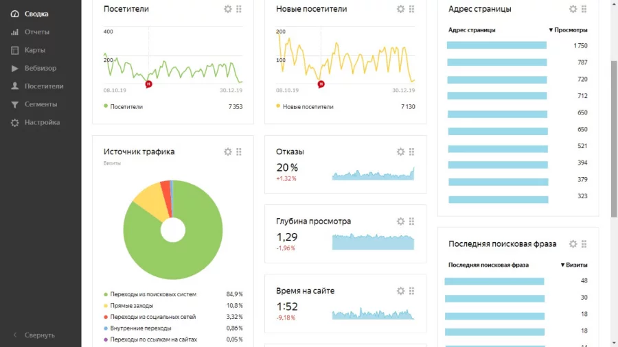

# Яндекс.Метрика

Сервис позволяет:

* отслеживать, откуда и с каких устройств пользователи приходят на ваш сайт;
* собирать статистику посещения конкретных URL и целевые действия на сайте;
* смотреть, по каким поисковым запросам приходят пользователи;
* находить самые популярные страницы сайта;
* получать статистику процента отказов, глубины просмотра, времени, проведенного на сайте;
* смотреть, как ведут себя пользователи на сайте (прокрутки, клики, переходы).

### Как вебмастеру использовать Яндекс.Метрику в работе?

### Анализировать посетителей.

Поскольку посетители сайта – основной источник дохода вебмастера, нужно знать про них все. Показатели помогают отслеживать, откуда пользователи приходят на сайт, как они ведут себя.

Например, вебмастеру может показаться, что он привлек поток посетителей через рекламу, а сервис покажет, что большая часть людей пришла по определенному поисковому запросу. Один источник привлечет пользователей, которые посмотрят одну страницу, другой тех, кто просмотрит две-три. Чем больше страниц посетит человек, тем больше рекламы он увидит. А значит, тем выше доход вебмастера.

Анализируя посещаемость таким образом, можно понять, от какой рекламы отказаться, а куда, наоборот, направить бюджет на продвижение.

### Оценивать показатель роботности.

Обычно роботы заходят на сайт, чтобы проиндексировать или проверить его работу. Но некоторые роботы маскируются под пользователей, чтобы имитировать их действия – кликать по ссылкам и повышать доход вебмастера. Поэтому рекламодатели редко размещают рекламу на площадках, где показатель роботности выше 10%. Доход от такого сайта будет ниже ожидаемого.

Чтобы это предотвратить, нужно отсеивать входящие запросы с уровнем фрода выше 5–10% через черные списки сайтов и IP-диапазонов. Если Яндекс.Метрика показала значение роботности от 10%, нужно отключить рекламу и предложить рекламодателю компенсацию фрода.

