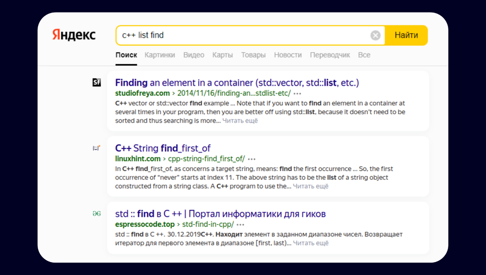

# Поиск Яндекса для программистов стал точнее

Что было: В Поиске работает нейросеть YaTI. Она ищет в интернете не по словам, а по смыслу. YaTI связывает запросы с информацией на страницах и понимает, что фразы «парк развлечений» и «американские горки» близки по значению.

<YouTube id="qlchHk4nCac" />

Промо на сайте Яндекса [CS YATI](https://yandex.ru/promo/unisearch/cs_search)

Что теперь: YaTI делает то же самое, но с документацией разработчиков. Она изучила сайты для программистов и связала их со специализированными поисковыми запросами. В этом помогли эксперты-программисты, которые показали наиболее релевантные документы, и новая нейросеть — CS YaTI. То есть Computer Science YaTI.

Бонус: В Поиске появился новый, более подробный блок с ответами из Stack Overflow. В нём не только ответ, но и сам код.

Также можно почитать подробнее на [Хабре](https://habr.com/ru/company/yandex/blog/688952/)

